# 🧠 From-Scratch SVM Multi Class Classifier (Python + cvxopt)

This repository contains a **Support Vector Machine (SVM)** classifier implemented from scratch in Python using **cvxopt** for quadratic programming.  
The project explores linear and non-linear decision boundaries using **linear**, **polynomial**, and **Gaussian (RBF)** kernels. :contentReference[oaicite:0]{index=0}

---

## 📚 Table of Contents

- [Overview](#-overview)
- [Features](#-features)
- [Methods](#-methods)
- [Results](#-results)
- [Tools](#-tools)
- [License](#-license)

---

## 🔎 Overview

The goal of this project is to **classify data points into their correct labels** using a custom SVM implementation.  
Instead of relying on high-level libraries, the SVM is built on top of **cvxopt** to directly solve the optimization problem, making the training process more transparent and educational. :contentReference[oaicite:1]{index=1}  

The workflow includes:

- Loading and preprocessing data  
- Training SVMs with different kernels  
- Hyperparameter tuning via grid search  
- Visualizing decision regions and measuring accuracy  

---

## ✨ Features

- ⚙️ **Custom SVM implementation**
  - Binary SVMs combined for **multiclass** classification
  - Uses **quadratic programming with cvxopt** and Lagrange multipliers :contentReference[oaicite:2]{index=2}  
- 🧮 **Multiple kernels**
  - Linear kernel  
  - Polynomial kernel  
  - Gaussian (RBF) kernel  
- 🧼 **Data preprocessing**
  - Standardization of features using `StandardScaler` to avoid scale dominance :contentReference[oaicite:3]{index=3}  
- 🔍 **Model selection**
  - Simple grid search over SVM hyperparameters
- 📈 **Evaluation & visualization**
  - Plots of original data groups and decision regions
  - Accuracy calculation for the trained model

---

## 🧪 Methods

The main steps in the codebase are:

1. **Data loading**
   - `load_txt`: load features and labels from a text file.

2. **Kernel definitions**
   - `linear_kernel`, `poly_kernel`, `gaussian_kernel`.

3. **SVM class**
   - Implements training using **cvxopt** for quadratic programming.
   - Supports multiclass classification via multiple binary SVMs.

4. **Preprocessing & description**
   - `preprocess_data`: standardizes features with `StandardScaler`.
   - `convert_to_dataframe_and_describe`: converts to pandas DataFrame and prints summary statistics.

5. **Training & tuning**
   - `svm_grid_search`: explores parameter combinations.
   - `train_model`: trains the final model and plots the decision regions.

6. **Evaluation**
   - Classifies the data and computes **accuracy**.

---

## 📊 Results

Final plots from the SVM experiments (before and after applying SVM for each dataset).  
All figures are stored in the `Results/` folder.

### Aggregation Dataset

| Aggregation (Without SVM) | Aggregation (With SVM Applied) |
| ------------------------- | ------------------------------ |
| 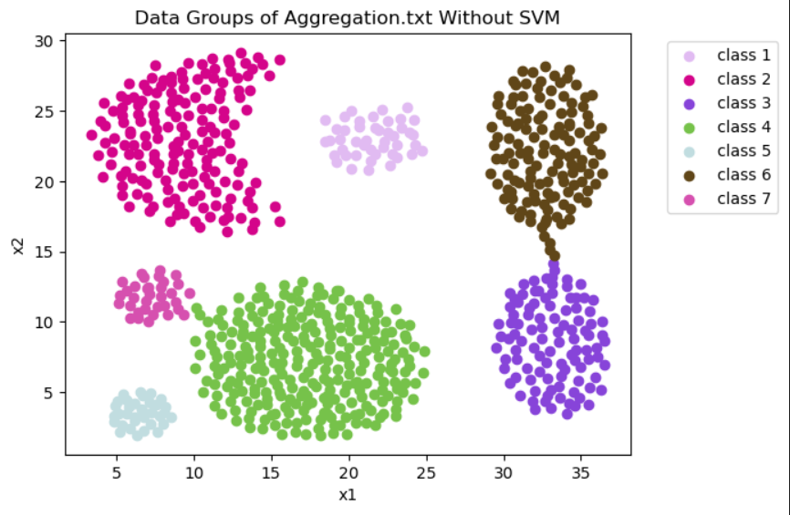 | 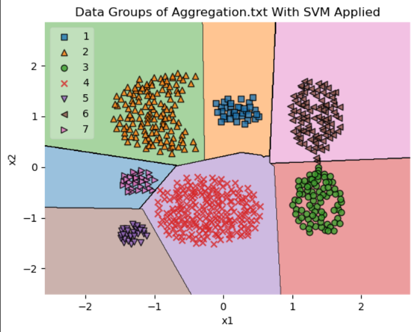 |

### Compound Dataset

| Compound (Without SVM) | Compound (With SVM Applied) |
| ---------------------- | --------------------------- |
| 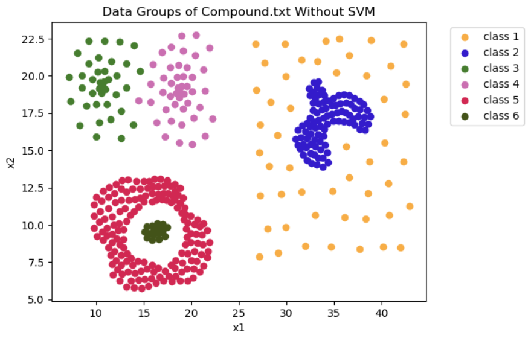 | 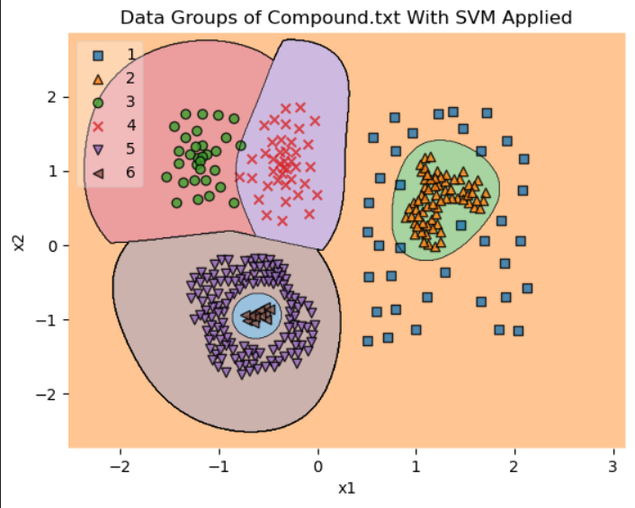 |

### Flame Dataset

| Flame (Without SVM) | Flame (With SVM Applied) |
| ------------------- | ------------------------ |
| 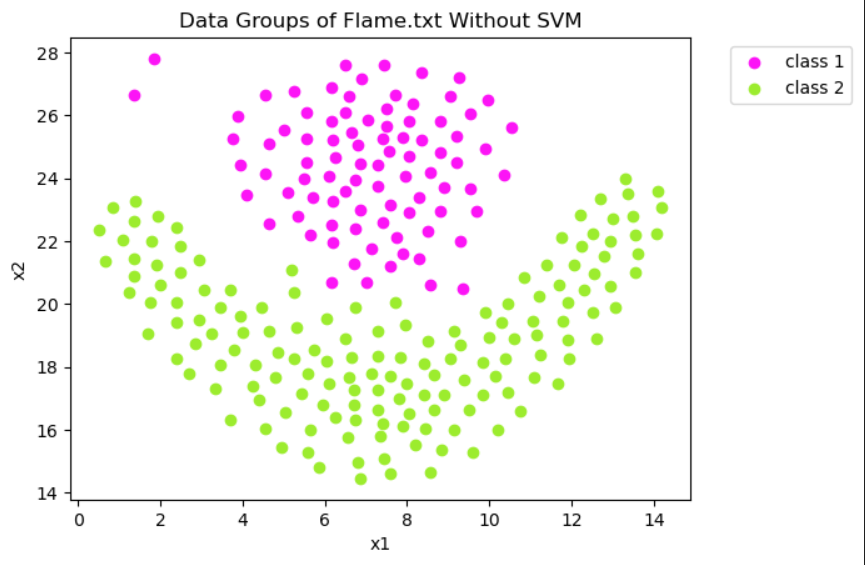 | 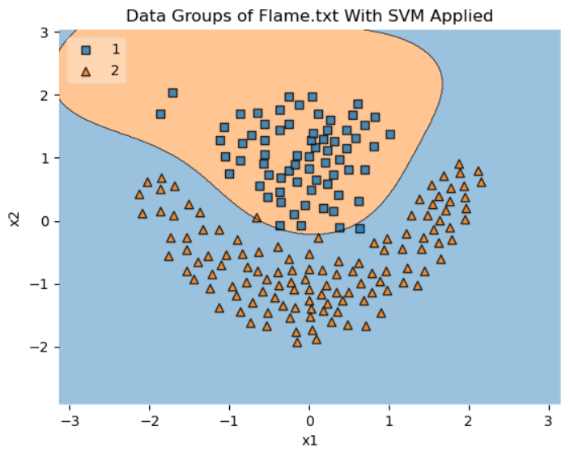 |

### Jain Dataset

| Jain (Without SVM) | Jain (With SVM Applied) |
| ------------------ | ----------------------- |
| 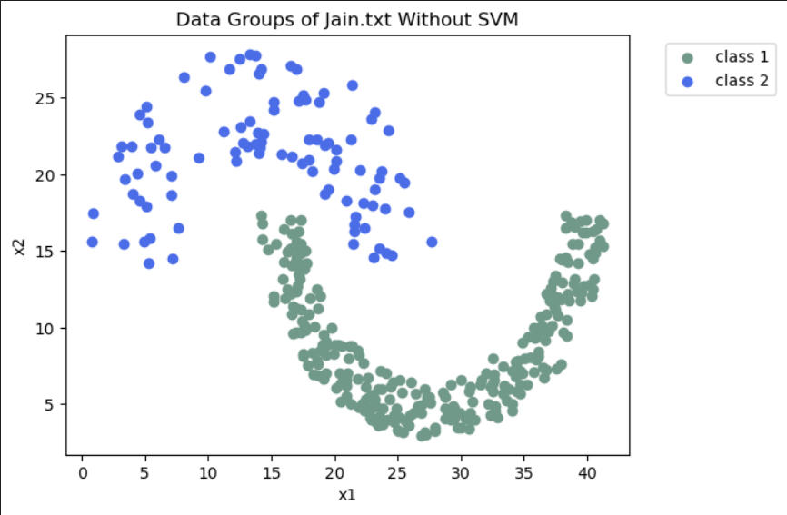 | 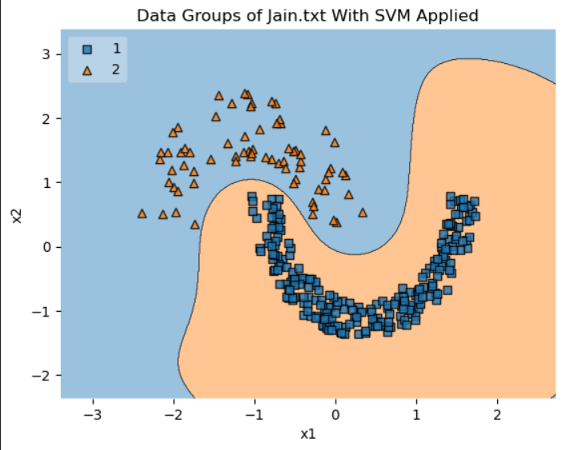 |

### Pathbased Dataset

| Pathbased (Without SVM) | Pathbased (With SVM Applied) |
| ------------------------ | ---------------------------- |
| 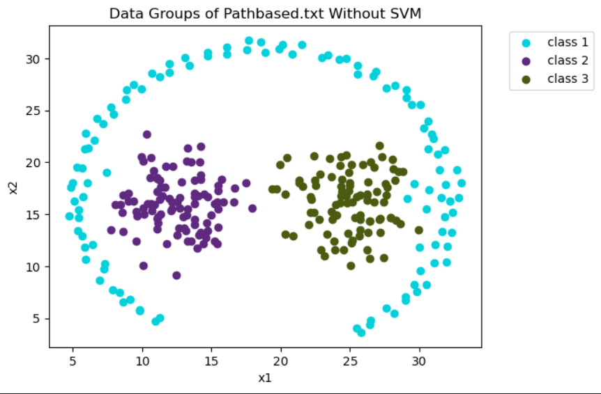 | 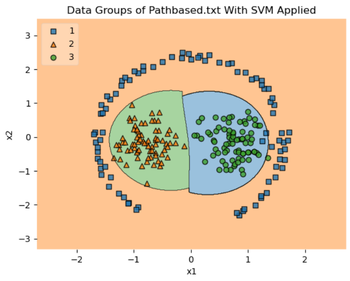 |

### Spiral Dataset

| Spiral (Without SVM) | Spiral (With SVM Applied) |
| -------------------- | ------------------------- |
| 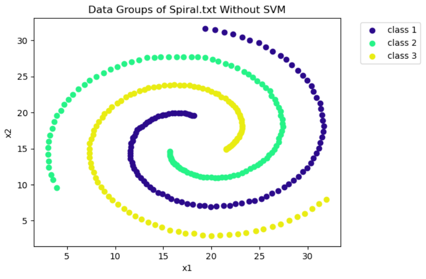 | 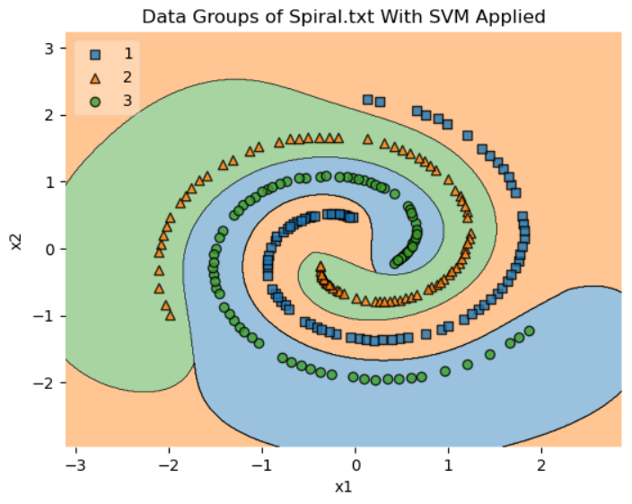 |

---

## 🛠️ Tools

- Python  
- cvxopt  
- NumPy  
- pandas  
- scikit-learn
- matplotlib  

---

## ⚖️ License

⚠️ **Important Notice:** This repository is publicly available for viewing only.  
Forking, cloning, or redistributing this project is **NOT** permitted without explicit permission.

Copyright (c) 2023 Chameleon Tech  
  

